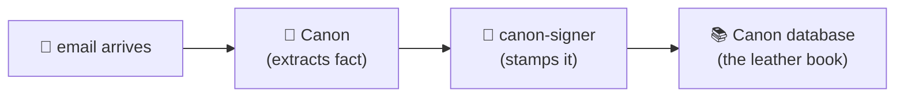
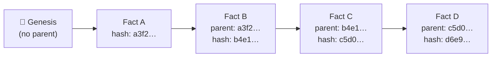
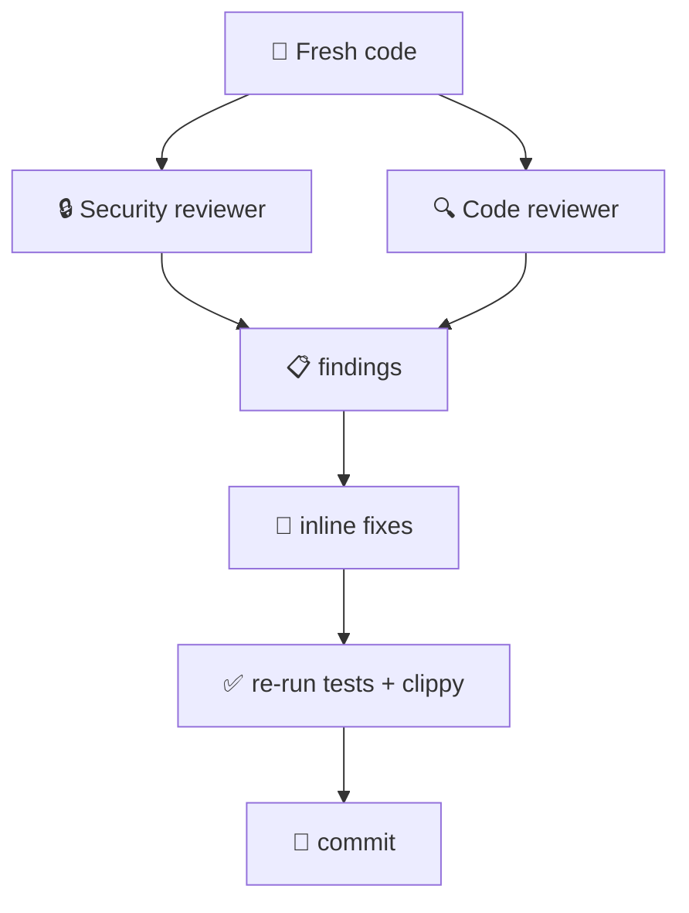

# canon-signer — The Story

> **For everyone.** No code, no jargon, no prior cryptography knowledge needed.
> **Technical companion:** [TECHNICAL.md](./TECHNICAL.md). **Demo playbook:** [HACKATHON.md](./HACKATHON.md).

---

## The problem, in one sentence

Canon reads your emails, extracts business facts ("Acme owes us €127,000"), and stores them. **How do you prove, six months later, that the fact was never tampered with?**

---

## The notary analogy

Imagine a notary in a small town. When a contract is signed, they:

1. Read the document.
2. Stamp it with a wax seal that nobody else has.
3. Write the seal number in a big leather-bound book, next to yesterday's entry.
4. Lock the book in a safe.

Three things make this trustworthy:

- **The stamp is unique.** Only the notary has it. Forging it is basically impossible.
- **The book is sequential.** Entry #1038 sits between #1037 and #1039. You can't insert #1038.5 later without everyone noticing.
- **Tampering is loud.** Rip out a page, and the numbering breaks.

`canon-signer` is the digital version of that notary.

> **Excalidraw version:** [`diagrams/notary.excalidraw`](./diagrams/notary.excalidraw) — email → Canon → canon-signer → ledger, plus the three-principles breakdown (unique stamp / sequential book / loud tampering).

---

## What's actually happening when a fact gets signed

Let's follow one fact from birth to forever.

**Step 1 — Canon reads an email.**

> Subject: Q1 numbers
> Our Q1 came in at 127k EUR, let's push harder on Q2.

**Step 2 — Canon decides: "That's a fact worth saving."** It turns the email into:

| field        | value                              |
|--------------|------------------------------------|
| who          | customer:acme                      |
| what         | "Q1 revenue was EUR 127,000"       |
| source       | gmail:msg_abc123                   |
| previous fact | (the last fact we signed)         |
| when         | 2024-04-24 10:00:00 UTC            |

**Step 3 — Canon hands this to `canon-signer`** through a pipe — literally stdin and stdout, like two programs talking over a walkie-talkie.

**Step 4 — `canon-signer` does three things in under a millisecond:**

1. **Packs the fact** into a fixed layout (so that **every computer on Earth** would pack it into exactly the same bytes).
2. **Stamps it** with a cryptographic signature — a 64-byte number that only this signer could produce.
3. **Hashes it** into a 64-character fingerprint (`event_hash`), which gets woven into the **next** fact.

**Step 5 — Canon stores the signed fact.** Years later, anyone with the right public key can re-open the envelope and check: "Is this the original fact? Signed by the right signer? Unchanged?"

---

## The "unchangeable chain" trick

Here's where it gets clever. Each fact **points backward** at the fact before it, by including its hash.

> **Excalidraw version:** [`diagrams/chain.excalidraw`](./diagrams/chain.excalidraw) — the clean 4-fact chain plus the tampered version underneath, showing exactly how Fact B edits poison Fact C's parent pointer.

Why is this clever? Say an attacker wants to secretly edit Fact B.

- They change "Q1 revenue was €127,000" to "Q1 revenue was €12,700."
- But B's hash is now different — because the fact itself is different.
- Which means Fact C's "parent" pointer is now wrong. C's hash is also different.
- And D. And E. And every single fact after B.
- To pull it off, they'd have to re-sign **every subsequent fact** — which requires the signer's private key, which they don't have.

The chain makes silent tampering impossible. Any attempt leaves a trail visible to anyone who checks.

This is the same trick Bitcoin uses. It's the same trick git uses. We didn't invent it — we just applied it to business facts from your inbox.

---

## "But couldn't they just fake the whole chain?"

Great question. No — because of the **signature**.

Each fact isn't just hashed; it's signed with an **Ed25519 private key** that lives inside the signer. The public half is known to everyone; the private half is known only to the signer.

- **Signing:** easy if you have the private key. Impossible if you don't.
- **Verifying:** anyone with the public key can check "yes, the holder of the private key did sign this."

To forge a fact, you'd need the private key. In Canon's deployment, that key lives in an environment variable on the production server and is zeroed from memory the instant it's been loaded. If you have access to that server, Canon has bigger problems than forged facts.

---

## The "rolling your own crypto" anecdote

There's a famous rule in security: **don't roll your own crypto.**

Early in the hackathon planning, the obvious move was: "Just write 80 lines of JavaScript using `@noble/ed25519`, done." And that would have *worked*. But it would have produced signatures in a homebrew format — ours, unique, un-reviewed. Six months from now, verifying those facts would require:

- finding our code,
- running it on whatever Node.js version we used,
- hoping we didn't make a subtle bug.

Instead, `canon-signer` uses **COSE_Sign1** — an envelope format standardised by the IETF (RFC 9052), implemented by Google's `coset` library, and used by WebAuthn, FIDO keys, and the entire IoT crypto ecosystem. Signatures produced today will be verifiable in 2034 by any library that speaks COSE, on any language, on any OS.

**It's the difference between a handshake deal and a notarised contract.** Both work, but only one holds up when someone challenges it.

---

## Why Rust, not Node.js?

Canon is written in Node.js. So why sneak a Rust binary in beside it?

Three reasons:

1. **Blast radius.** If the signer crashes (bug, out-of-memory, anything), Canon sees the pipe close and respawns it. A crash in a Node library **crashes all of Canon**. Process isolation is free insurance.
2. **Speed.** Rust's Ed25519 implementation signs in ~20 microseconds. A thousand facts per second, from a laptop.
3. **Ecosystem.** `ed25519-dalek` and `coset` are battle-tested, audited, and used in production by companies whose names you've heard of. Porting them to pure JavaScript would take months and still not be as fast or as safe.

---

## How we know it actually works

### Test 1 — "The round trip" (load-bearing)

We spawn the binary, send it a fact, get back a signed envelope. Then we rebuild what the envelope *should* contain from scratch — in the test, independently — and compare byte-by-byte. If one bit is off, this test fails, and we refuse to ship.

### Test 2 — "The tamper detector"

Sign a fact. Flip a single bit in the envelope. Run it through the verifier. The verifier must reject it. If it accepts, something is very wrong, and we refuse to ship.

### Test 3 — "The chain"

Sign fact A. Sign fact B pointing at A. Now re-sign fact A, same inputs — check: did we get the exact same hash as last time? If no, the chain is broken, and we refuse to ship.

### Test 4 — "The marathon"

Spawn the signer, send it 100 facts in a row, measure latency. Median under 50ms, worst case under 200ms. If the signer slows down, leaks memory, or drops facts, we refuse to ship.

### Test 5 — "The junk stream"

Throw garbage at the signer. A malformed JSON line. An oversized payload. A request with the wrong operation name. The signer must respond with a clean error and keep running. If it crashes or hangs, we refuse to ship.

**Total: 38 tests. All green. Every commit.**

---

## The review-swarm — our "second and third pair of eyes"

Here's the part that's new and, honestly, a little sci-fi.

When we finished writing the code, we didn't just run the tests and call it done. We spun up **two AI reviewers in parallel:**

- A **security reviewer** whose only job was to find crypto mistakes, memory-safety issues, and attack surfaces.
- A **code reviewer** whose only job was to find bugs, sloppy patterns, and hidden assumptions.

> **Excalidraw version:** [`diagrams/review-swarm.excalidraw`](./diagrams/review-swarm.excalidraw) — the full parallel pipeline plus the sidebar of real bugs the swarm caught on canon-signer itself.

They flagged 0 critical, 4 high, 5 medium, 4 low, and 3 nitpick findings. We folded every single one. Real bugs they caught:

- **A stack buffer holding the raw Ed25519 seed** wasn't being zeroed out after use. Fixed: now it is.
- **A hex-encoded seed string** was handed to `fs::write` but the string itself lived in memory afterward. Fixed: zeroed after the write.
- **An error message slug** was ambiguous (`parse_error` was used for both malformed JSON and unknown operations). Split into `parse_error` and `unsupported_op`.
- **A test that looked like it was checking something** actually silently passed even if the check failed. Fixed: now it really checks.

None of those would have been catastrophic. All of them would have been embarrassing if a hackathon judge had found them first.

---

## Why this is innovative (for a hackathon)

Most "signed database" or "blockchain-for-business" demos do one of these:

- ❌ Roll their own signature format → works but unverifiable in 3 years.
- ❌ Use JWTs → no chain, so re-ordering or dropping facts is invisible.
- ❌ Put it on a real blockchain → expensive, slow, and overkill.
- ❌ Skip the crypto entirely and call it "tamper-evident" → it's not.

Canon does something subtle but correct:

- ✅ Uses an **IETF-standard envelope** (COSE_Sign1) → verifiable by any language, any library, any decade.
- ✅ Uses a **domain-separated AAD** → signatures can't be reused across protocols.
- ✅ Uses a **hash chain** → re-ordering or editing history is immediately detectable.
- ✅ Uses a **role-bound trust anchor** → even the same key used in a different context won't verify.
- ✅ **Reuses production crypto** from an audited Rust workspace, not hackathon throw-away code.
- ✅ Is **independently verifiable** — the verifier is a separate library, not a method on the signer.

The innovation isn't "we invented a thing." It's **"we correctly assembled five known-good things in a way most people don't bother with at a hackathon."**

---

## One more anecdote — the AAD story

The "external AAD" (Additional Authenticated Data) is a short constant — `b"canon/fact/v1"`. Seven bytes. Plus four.

Why does it matter?

Imagine a parallel universe where Canon later adds a **second** signer — say, a `tariff-signer` that signs shipping rates. Both signers use Ed25519. An attacker learns an old Canon fact-signature, scrapes out the raw Ed25519 signature bytes, and tries to paste them onto a forged tariff.

Without an AAD: the signature is mathematically valid (it's a real Ed25519 signature of *something*), and a naive verifier accepts it. Bug.

With the AAD: the signature is bound to the exact bytes `canon/fact/v1`. A tariff verifier expecting `tariff/rate/v1` does the math, gets a mismatch, and rejects. Safe.

**Eleven bytes** of plain-text constant, **decades** of cross-protocol safety. That's the kind of detail hackathon projects usually skip and auditors later cry about.

We didn't skip it.

---

## TL;DR for non-engineers

> We take every business fact Canon extracts, wrap it in a tamper-evident envelope using the same cryptography standards that secure WebAuthn and hardware keys, and chain every fact to the one before it so you can't silently edit the past. If a single byte changes, verification fails. The whole thing is a 2 MB Rust binary, runs in under a millisecond per fact, and uses production-audited libraries — not hackathon code.

That's it. That's the product.
