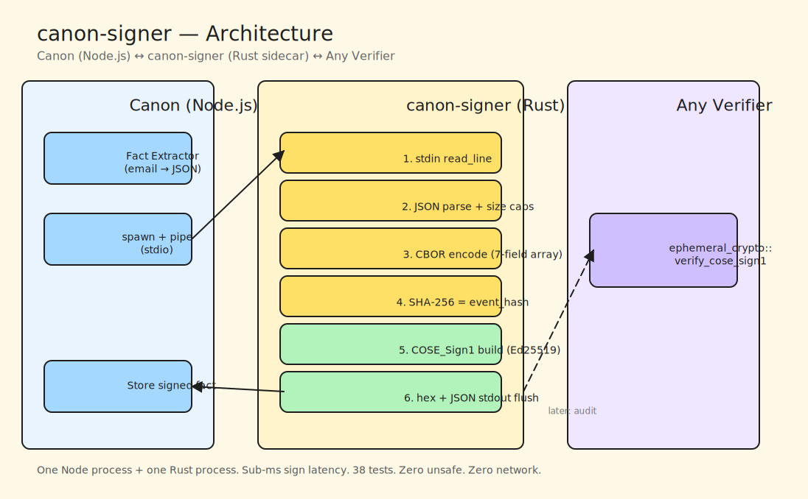
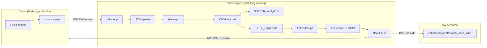
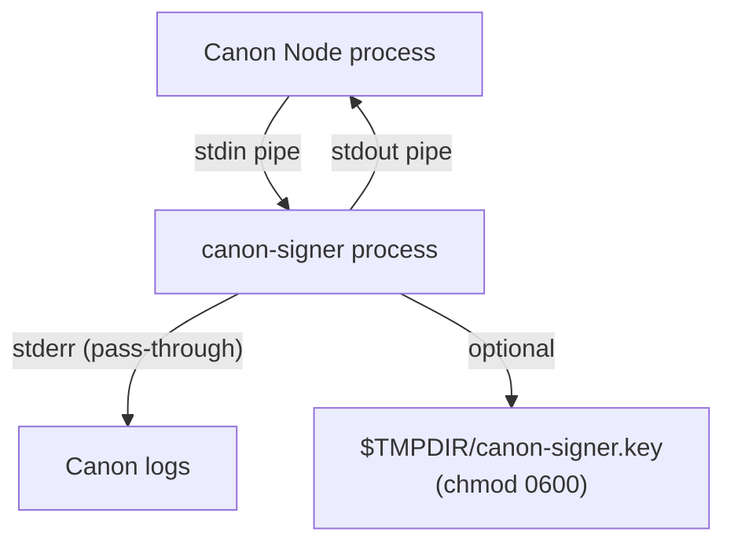
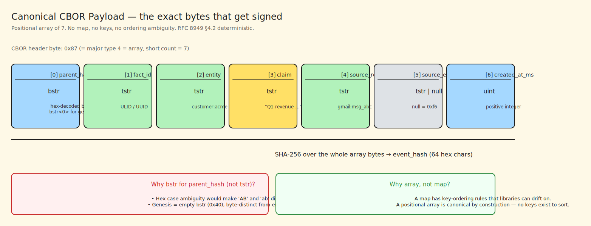
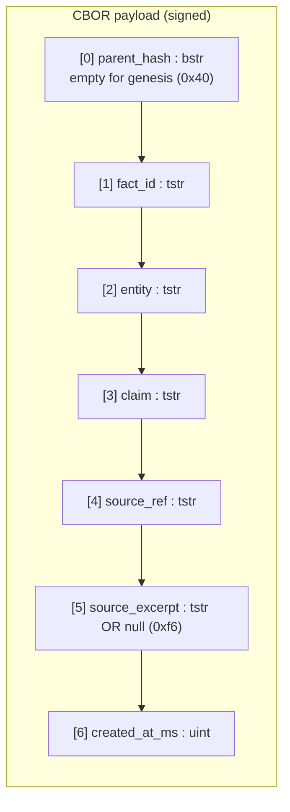
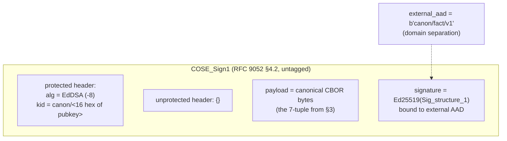
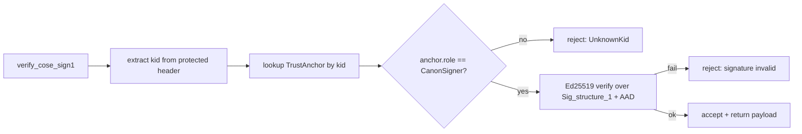
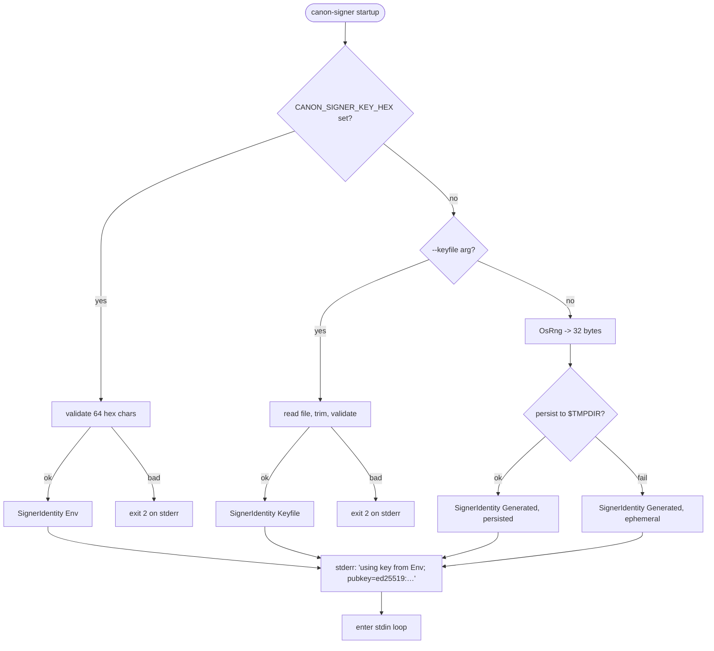

# canon-signer — Technical Deep Dive

> **Audience:** engineers, auditors, reviewers who need to reason about the crypto, the wire format, and the threat model.
> **Companion docs:** [EXPLAINER.md](./EXPLAINER.md) (non-technical), [HACKATHON.md](./HACKATHON.md) (demo guide).

---

## 0. TL;DR

`canon-signer` is a **78 KB Rust binary** that turns a newline-delimited JSON "fact" on stdin into a cryptographically signed COSE_Sign1 envelope on stdout. One process, spawned once by Canon's Node.js server, kept alive for the lifetime of the parent. Sub-millisecond sign latency. 38 tests, zero `unsafe`, zero network, zero disk writes (except optional key persistence to `$TMPDIR`).

| Property                | Value                                                                 |
|-------------------------|-----------------------------------------------------------------------|
| Signature scheme        | Ed25519 (strict-mode via `ed25519-dalek`)                             |
| Envelope                | COSE_Sign1, RFC 9052 §4.2, untagged                                   |
| Canonical encoding      | CBOR positional array of 7 (RFC 8949 §4.2 deterministic subset)       |
| Event hash              | SHA-256, lowercase-hex                                                |
| Domain separation       | external AAD `b"canon/fact/v1"`                                       |
| Transport               | NDJSON over stdin/stdout, one line in = one line out                  |
| Key source priority     | `CANON_SIGNER_KEY_HEX` env → `--keyfile` → auto-gen + persist         |
| Attack surface          | 1 binary, 0 sockets, ≤1 file (optional keyfile)                       |
| Test count              | 31 unit + 7 integration = 38                                          |

---

## 1. Architecture



<details><summary>Mermaid source (fallback)</summary>



</details>

> **Editable source:** [`diagrams/architecture.excalidraw`](./diagrams/architecture.excalidraw) — open in [excalidraw.ultranova.io](https://excalidraw.ultranova.io) or the Obsidian Excalidraw plugin (File → Import → `.excalidraw`).

### 1.1 Why a sidecar and not FFI or pure-JS

| Approach                      | Problem                                                                   |
|-------------------------------|---------------------------------------------------------------------------|
| **Pure JS (`@noble/ed25519`)** | No standards-compliant COSE encoder; rolled crypto reviewed only by us    |
| **FFI (napi, neon)**          | Binary ABI drift across Node versions, crash in signer = crash in Canon   |
| **HTTP microservice**         | Extra network hop, TLS provisioning, larger attack surface                |
| **Sidecar (chosen)**          | Process isolation, language-agnostic, crash-isolated, zero network        |

A panic in `canon-signer` closes its pipe → Canon sees EOF → Canon respawns. Canon keeps serving.

### 1.2 Process topology



---

## 2. Wire Protocol

### 2.1 Request (one JSON object per line)

```json
{
  "op": "sign",
  "fact_id": "f_01HQR_abc",
  "entity": "customer:acme",
  "claim": "Q1 revenue was EUR 127,000",
  "source_ref": "gmail:msg_abc123",
  "source_excerpt": "Our Q1 came in at 127k EUR...",
  "parent_hash": "",
  "created_at_ms": 1713974400000
}
```

Field contract in [io.rs:29](../src/io.rs#L29).

| Field            | Type          | Bounds / Notes                                                |
|------------------|---------------|---------------------------------------------------------------|
| `op`             | string        | must be `"sign"` (today); else `unsupported_op`               |
| `fact_id`        | string        | ≤ 64 KiB; caller-supplied stable id (ULID/UUID)               |
| `entity`         | string        | ≤ 64 KiB; subject reference                                   |
| `claim`          | string        | ≤ 64 KiB; the assertion                                       |
| `source_ref`     | string        | ≤ 64 KiB; opaque upstream pointer                             |
| `source_excerpt` | string\|null  | ≤ 64 KiB or null                                              |
| `parent_hash`    | string        | `""` = genesis; else lowercase hex, ≤ 128 chars (SHA-512 max) |
| `created_at_ms`  | uint          | caller owns the clock                                         |

### 2.2 Response (success)

```json
{
  "fact_id": "f_01HQR_abc",
  "event_hash": "b4e1c2a0…<64 hex chars>",
  "cose_sign1_hex": "d28443a10127…",
  "signer_pubkey": "ed25519:oBE6mV8W…",
  "signed_at_ms": 1713974400017
}
```

### 2.3 Response (error)

```json
{ "error": "parse_error", "detail": "invalid JSON: expected field `fact_id` …" }
```

| Error slug          | Meaning                                                   |
|---------------------|-----------------------------------------------------------|
| `parse_error`       | JSON malformed or a field failed validation               |
| `unsupported_op`    | `op` was something other than `"sign"`                    |
| `payload_too_large` | A string field exceeded the 64 KiB per-field cap          |
| `internal_error`    | Unexpected — e.g. COSE encoder bug (should never fire)    |

**Critical:** the loop writes exactly one response per input line and continues. A bad line never terminates the subprocess — see [run_stdin_loop in io.rs:165](../src/io.rs#L165) and the `run_loop_survives_bad_line_between_good_lines` test.

---

## 3. Canonical Payload (The Load-Bearing Format)

The signed bytes are a **CBOR positional array of 7 elements**, fixed order:



<details><summary>Mermaid source (fallback)</summary>



</details>

> **Editable source:** [`diagrams/cbor-layout.excalidraw`](./diagrams/cbor-layout.excalidraw)

**Why positional array, not a map?** A CBOR map has key-ordering ambiguity; canonicalisation rules exist (RFC 8949 §4.2) but bite you if a library drifts. A positional array is canonical by construction: no keys, no ordering question.

**Why `bstr` for `parent_hash`, not `tstr`?**
- Hex strings have a case ambiguity (`"AB"` vs `"ab"`). Bytes don't.
- Genesis encodes as the empty byte-string `0x40`, byte-distinct from an empty text-string `0x60`.
- Binary comparison is the path Canon consumers use downstream.

**`event_hash = hex_lowercase(SHA-256(payload_bytes))`** — 64 hex chars. See [event.rs:102](../src/event.rs#L102).

### 3.1 Determinism invariants (test-enforced)

1. Same request fields → bit-identical `event_hash`. No wall-clock, no salt, no counter mixed in. ([chain.rs:36](../tests/chain.rs#L36))
2. Flipping **any** field including `parent_hash` produces a different `event_hash` — re-parenting attacks detectable. ([chain.rs:46](../tests/chain.rs#L46))
3. Independently re-encoding the payload in the test suite yields the exact bytes recovered from the envelope. ([round_trip.rs:43](../tests/round_trip.rs#L43))

---

## 4. COSE_Sign1 Envelope



### 4.1 External AAD — the domain separator

`external_aad = b"canon/fact/v1"` (defined once in [lib.rs:41](../src/lib.rs#L41)).

This binds every Canon signature to **this protocol, this version**. If the same Ed25519 key were ever reused for an EPHEMERAL envelope (which uses AADs like `b"tariff"` or `b"ephemeral/anomaly-library/v1"`), a verifier using the Canon AAD would reject the EPHEMERAL envelope and vice-versa. Cross-protocol reuse is structurally impossible.

Test: `wrong_aad_rejects_signature` in [cose.rs:134](../src/cose.rs#L134).

### 4.2 Key ID (`kid`) format

`canon/<first-16-hex-chars-of-raw-Ed25519-public-key>` — UTF-8 string, not bytes.

- 16 hex chars = 8 bytes of entropy = collision prob. 2⁻³² per 65k keys (more than enough to disambiguate signers).
- UTF-8 (not bytes) because `ephemeral_crypto::extract_kid` rejects non-UTF-8 kids — the verification library is the same production code EPHEMERAL uses.

### 4.3 Signature construction

```rust
// cose.rs:49 — CoseSign1Builder from the coset crate
let sign1 = CoseSign1Builder::new()
    .protected(protected)
    .payload(payload.to_vec())
    .create_signature(COSE_EXTERNAL_AAD, |tbs| {
        signing_key.sign(tbs).to_bytes().to_vec()
    })
    .build();
```

`tbs` ("to-be-signed") is `Sig_structure_1` per RFC 9052 §4.4: a CBOR array that concatenates the protected header, the external AAD, and the payload. Ed25519-sign that. Untagged output so it decodes with `CoseSign1::from_slice` directly.

---

## 5. Trust Anchor Binding (Role Confusion Defence)

The verifier does **not** accept "this signature verifies under this pubkey." It requires: "this signature verifies under this pubkey **registered under this role** for **this AAD**."



Test: `wrong_role_rejects_signature` in [cose.rs:159](../src/cose.rs#L159) — same key, wrong role (`TariffSigner`), verification collapses.

---

## 6. Key Lifecycle



### 6.1 Zeroize discipline

Every buffer that held raw seed material is explicitly zeroized after use ([key.rs](../src/key.rs)):

```rust
let mut seed = hex::decode(trimmed)?;          // Vec<u8>
let mut arr: [u8; 32] = seed.as_slice().try_into()?;
let sk = SigningKey::from_bytes(&arr);
seed.zeroize();   // heap buffer
arr.zeroize();    // stack buffer — easy to miss
// sk itself is ZeroizeOnDrop via ed25519-dalek
```

Persistence path also scrubs the hex-encoded seed string after `fs::write`:

```rust
let mut hex_seed = hex::encode(raw_seed);
let write_result = std::fs::write(&path, hex_seed.as_bytes());
hex_seed.zeroize();
```

On unix, the keyfile is chmod'd `0600` best-effort. If the chmod fails, the log line mentions the path so the operator can lock it down.

---

## 7. Threat Model

| Threat                                           | Mitigation                                                                 | Enforced by                             |
|--------------------------------------------------|----------------------------------------------------------------------------|-----------------------------------------|
| Tamper with stored `cose_sign1_hex` bytes        | Signature verification fails                                               | `round_trip::tampered_envelope_fails`   |
| Re-parent a historical fact                      | `event_hash` depends on `parent_hash`; any swap changes the hash           | `chain::flipping_parent_hash_changes…`  |
| Cross-protocol signature reuse (Canon ↔ EPHEMERAL) | Fixed external AAD `b"canon/fact/v1"`                                     | `cose::wrong_aad_rejects_signature`     |
| Role confusion (same key used for wrong purpose) | TrustAnchor is keyed by `(kid, role)` tuple                               | `cose::wrong_role_rejects_signature`    |
| Adversarial oversize input → OOM                 | 64 KiB cap per string field, 128-char cap on `parent_hash` hex             | `io::oversized_claim_yields_payload…`   |
| Malformed JSON crashes the loop                  | `handle_line` returns error response; loop continues                       | `io::run_loop_survives_bad_line…`       |
| Seed material lingers in freed memory            | Explicit `zeroize()` on Vec, `[u8; 32]`, and hex String; SigningKey is ZoD | code-audit + Drop semantics             |
| Sidecar crash brings down Canon                  | Process boundary: pipe EOF, Canon respawns                                 | OS process isolation                    |

### 7.1 What canon-signer does **not** defend against

- **Compromised seed**: if `$CANON_SIGNER_KEY_HEX` leaks, an attacker can forge any future fact. Key rotation is a Canon-level responsibility (restart with a new seed).
- **Chosen-plaintext attacks on Ed25519**: Ed25519 is designed to be SUF-CMA; we add nothing to that beyond strict verification.
- **Timing side-channels on verify**: `ed25519-dalek` uses constant-time primitives; we don't introduce timing leaks, but we don't claim an audit beyond that.
- **Lost history**: `canon-signer` doesn't persist the chain. Canon stores facts; if Canon loses them, the signer cannot reconstruct them.

---

## 8. Dependencies (Audited Surface)

| Crate            | Purpose                              | Why this one                                        |
|------------------|--------------------------------------|-----------------------------------------------------|
| `ed25519-dalek`  | Ed25519 sign + verify                | RustCrypto, constant-time, strict-mode, ZoD keys    |
| `coset`          | COSE_Sign1 encode/decode             | Google-maintained, RFC 9052 reference impl          |
| `ciborium`       | CBOR encode/decode                   | RustCrypto-adjacent, deterministic encoder          |
| `sha2`           | SHA-256                              | RustCrypto                                          |
| `ephemeral-crypto` | Production verifier + TrustAnchorSet | Same crate that guards EPHEMERAL's signed envelopes |
| `zeroize`        | Seed scrubbing                       | De-facto standard                                   |
| `rand_core`      | `OsRng` for auto-gen                 | Drawn via `ed25519-dalek` transitively              |
| `base64`, `hex`  | Wire encoding                        | Tiny, widely reviewed                               |
| `serde`, `serde_json` | Request/response JSON           | Industry standard                                   |
| `thiserror`      | Error derive                         | Standard in Rust error ergonomics                   |

Zero optional features. Zero `unsafe`. `#![forbid(unsafe_code)]` at crate root.

---

## 9. Verification Recipe (for Auditors)

```rust
use ephemeral_crypto::{verify_cose_sign1, AnchorRole, TrustAnchor, TrustAnchorSet};

// 1. Get the pubkey bytes out of the response's signer_pubkey field.
//    Format: "ed25519:<base64>" — strip prefix, base64-decode.
let pubkey_bytes: [u8; 32] = /* decode signer_pubkey */;

// 2. Derive the kid the same way canon-signer did.
let kid = format!("canon/{}", &hex::encode(pubkey_bytes)[..16]);

// 3. Register the anchor under AnchorRole::CanonSigner.
let mut anchors = TrustAnchorSet::new();
anchors.insert(
    TrustAnchor::new_ed25519(kid, &pubkey_bytes, AnchorRole::CanonSigner)?
)?;

// 4. Verify. Returns the recovered payload bytes.
let verified = verify_cose_sign1(
    &hex::decode(cose_sign1_hex)?,
    &anchors,
    b"canon/fact/v1",   // external AAD — must match exactly
    AnchorRole::CanonSigner,
)?;

// 5. Check event_hash = SHA-256(verified.payload).
assert_eq!(
    hex::encode(sha2::Sha256::digest(&verified.payload)),
    event_hash_from_response
);
```

If any step fails, **do not trust the fact**.

---

## 10. Test Matrix (38 tests)

| Layer        | File                      | Count | What it proves                                                        |
|--------------|---------------------------|-------|-----------------------------------------------------------------------|
| Unit         | `src/event.rs`            | 10    | Canonical CBOR layout, hash determinism, parent-hash bounds           |
| Unit         | `src/cose.rs`             | 4     | Envelope builds + verifies via `ephemeral_crypto` (same-process)      |
| Unit         | `src/io.rs`               | 8     | Wire types, error slugs, loop recovery, size caps                     |
| Unit         | `src/key.rs`              | 5     | Env / keyfile / autogen paths, error cases                            |
| Unit         | `src/io.rs` helpers       | 1     | `ed25519:<base64>` pubkey wire format stability                       |
| Unit         | `src/event.rs` (hash)     | 3     | Re-signed fact is bit-identical; field changes propagate              |
| **Integration** | `tests/smoke.rs`       | 1     | Spawn + one request + well-formed response                            |
| **Integration** | `tests/round_trip.rs`  | 2     | **Load-bearing:** envelope verifies, payload round-trips, tamper fails |
| **Integration** | `tests/chain.rs`       | 2     | Chain-of-two correctness + re-sign determinism + anti-re-parent       |
| **Integration** | `tests/persistence.rs` | 1     | 100 signs in one subprocess: median <50ms, p99 <200ms                 |
| **Integration** | `tests/error_recovery.rs` | 1  | Malformed line doesn't kill the loop                                  |

The **round-trip test is the one that matters**: if it fails, every Canon fact becomes un-verifiable. It builds the canonical CBOR independently in the test, then compares against what `ephemeral_crypto::verify_cose_sign1` recovers from the envelope. Bit-equality or bust.

---

## 11. Build & Deploy

```bash
# Local dev (Windows)
cd reference/validator
cargo build -p canon-signer --release
# → target/release/canon-signer.exe

# Production (Linux musl, for Canon's Alpine container)
rustup target add x86_64-unknown-linux-musl
cargo build -p canon-signer --release --target x86_64-unknown-linux-musl
# → target/x86_64-unknown-linux-musl/release/canon-signer (static, ~2 MB)
```

Canon's Dockerfile multi-stage (from [README.md §Dockerfile snippet](../README.md)):

```dockerfile
FROM rust:1.82-alpine AS signer-builder
RUN apk add --no-cache musl-dev
COPY reference/validator ./validator
RUN cd validator && cargo build -p canon-signer --release --target x86_64-unknown-linux-musl

FROM node:20-alpine
COPY --from=signer-builder /validator/target/x86_64-unknown-linux-musl/release/canon-signer /usr/local/bin/
```

---

## 12. Quick Glossary

- **COSE_Sign1** — a CBOR-encoded envelope that wraps a payload + signature + header, defined by RFC 9052. Used by FIDO, WebAuthn, and the whole IETF crypto-in-constrained-environments stack.
- **Canonical CBOR** — a deterministic byte-encoding for CBOR values. Same input = same bytes on every implementation.
- **External AAD** — Additional Authenticated Data not stored in the envelope but mixed into the signature. Used for domain separation.
- **Ed25519** — an elliptic-curve signature scheme (curve25519 in Edwards form). Fast, small, deterministic signatures, 32-byte keys + 64-byte signatures.
- **Kid** — Key Identifier. Embedded in the COSE header so verifiers know which key to look up.
- **TrustAnchor** — the verifier's (kid, pubkey, role) triple. Registering a key under one role does not allow verification under another.
- **NDJSON** — Newline-Delimited JSON. One JSON value per line. Trivial to stream.
- **Hash chain** — a sequence where each entry includes the hash of the previous; changing any past entry changes every subsequent hash.
